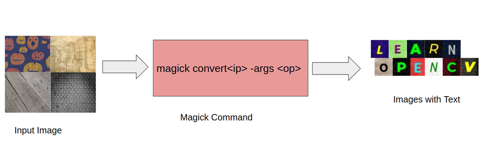
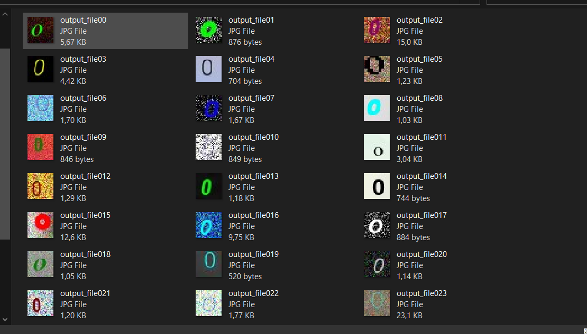

# Synthetic Data



## Step 1

Download tool ImgMagick [here](https://www.imagemagick.org/script/download.php)
## Step 2 

Download tool simple google image download [here](https://github.com/RiddlerQ/simple_image_download)
```
git clone https://github.com/RiddlerQ/simple_image_download
cd simple_image_download/simple_image_download

```
## Step 3
**copy** img_download.py and **paste in folder simple_image_download/simple_image_download**

Download font [here](https://fonts.google.com/)

## Step 4 Synthetic data 
```
python generate_images.py
```
## RESULTS




